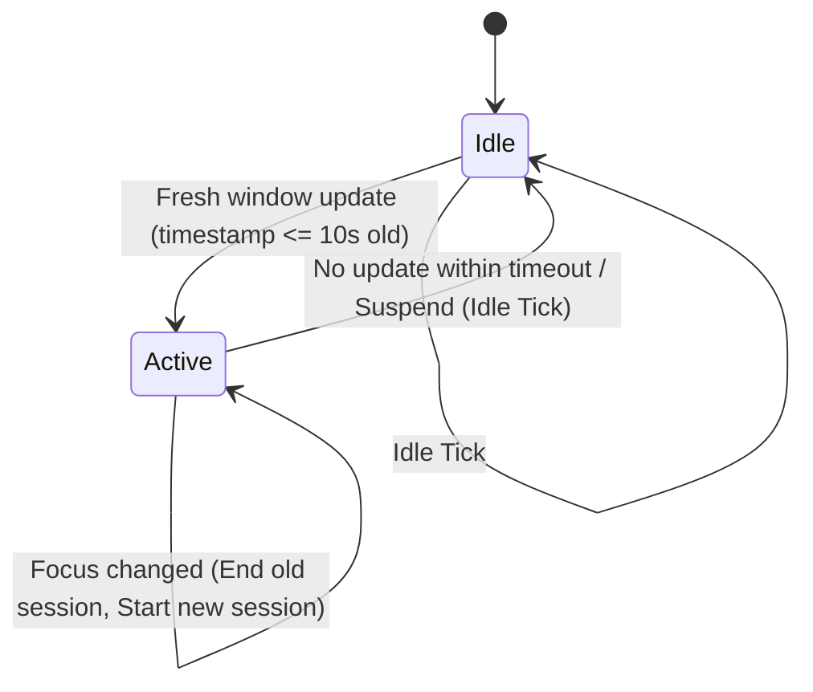

# Trackora Maintainer & Contributor Guide

Welcome to the Trackora codebase! This handbook was written by the creators of Trackora for anyone stepping in to maintain, debug, or expand the project. 

Trackora is a privacy-first, local-first screen time and activity tracker optimized for Linux desktop environments (specifically GNOME Shell on Wayland). Before diving into the technical specifications, it is vital to understand the core philosophy and history that shape this project.

---

## 1. Project Philosophy & Design Principles

Trackora was born out of a simple frustration: **most productivity tools make you do work to track your work.** They demand start/stop rituals, manual task categorizations, and subscription logins. They also frequently suffer from security and architectural limitations on modern Linux desktops.

We built Trackora around four non-negotiable principles:

*   **Zero-Friction Tracking**: The user should never have to toggle a timer or remember to check in. If they are using their computer, Trackora tracks it. If they walk away or close the app, the system handles it gracefully.
*   **Absolute Local Privacy (Local-First)**: Screen time data is highly personal. It reveals when you sleep, what you work on, and what you do when you are not working. Trackora never uploads your data, never requires an account, and stores everything in a standard SQLite database on your own disk. If the user wants to sync their data, they can back up or copy the SQLite database themselves.
*   **Low Overhead**: Background tracking must be invisible. It should not consume CPU cycles, cause disk thrashing, or eat memory. The daemon sits at around 15MB of RAM, and the database only writes on window switches or every few seconds on a heartbeat.
*   **Aesthetic Excellence**: A tool that tracks time should be pleasant to look at. We avoid generic system colors and standard, unstyled widgets. We use curated HSL color schemes, custom paint events, glassmorphism borders, and fluid, accelerated micro-animations.

---

## 2. Why Trackora Exists & The Wayland Conundrum

### The Wayland compositor isolation issue
On legacy X11 sessions, any running process could spy on the entire display server, query active window classes, read keypresses, and capture window titles. Under Wayland, this is blocked by design for security. A standard user space process running on Wayland is sandboxed from other windows; it cannot see what application is currently focused.

To solve this without compromising Wayland's security model, Trackora splits data collection into an **in-process compositor extension** and a **user space analysis daemon**.

The GNOME Shell extension runs directly inside the compositor (`gnome-shell`/`mutter`). Because it is inside the compositor, it has access to the internal window manager APIs (`global.display.get_focus_window()`). It writes the active application and window title to a secure, locally-owned JSON file. The Python daemon then reads this file, keeping the python process completely sandboxed from Wayland's display server.

---

## 3. Project Architecture & Trade-Offs

Trackora is split into four decoupled layers to balance system safety, performance, and UI dynamics:

```mermaid
graph TD
    A[GNOME Shell Extension] -->|Write JSON focus updates every 3s| B[~/.local/share/trackora/current_window.json]
    B -->|Read & track state machine| C[Python Background Daemon]
    C -->|Persist session records| D[(SQLite Database: trackora.db)]
    D -->|Query periodic updates| E[PySide6 Desktop Dashboard]
    
    style B fill:#171f2a,stroke:#1c2735,stroke-width:2px;
    style D fill:#171f2a,stroke:#1c2735,stroke-width:2px;
    style A fill:#3b82f6,stroke:#1d4ed8,stroke-width:2px,color:#fff;
    style C fill:#3b82f6,stroke:#1d4ed8,stroke-width:2px,color:#fff;
    style E fill:#3b82f6,stroke:#1d4ed8,stroke-width:2px,color:#fff;
```



### Architectural Trade-offs
*   **File-Based IPC vs. D-Bus**: We chose file-based IPC (`current_window.json`) over D-Bus interfaces. 
    *   *Trade-off*: D-Bus is event-driven and avoids periodic disk writes. However, writing and debugging D-Bus interfaces in GJS (GNOME Javascript) is notoriously error-prone, sensitive to GNOME Shell version updates, and hard to sandbox. File IPC is simple, robust, easy to inspect (`cat current_window.json`), and completely decouples the shell extension lifecycle from the python daemon's state.
*   **Headless Daemon vs. Integrated GUI**: The background tracking service has zero dependency on PySide6 or any GUI library.
    *   *Trade-off*: If we integrated the tracking daemon into the GUI, we would only have one process to manage. However, users would be forced to keep a heavy GUI window running to track their screen time. By decoupling them, the tracking daemon runs as a tiny headless systemd user service consuming minimal resources.

---

## 4. Directory Structure Reference

Below is a map of the repository to guide your navigation:

```text
Trackora/
├── assets/                  # Logos, custom fonts, and styling assets
├── shell-extension/         # GNOME Shell Extension (JavaScript/GJS)
│   └── trackora@trackora.dev/
│       ├── extension.js     # Extension lifecycle and window event hooks
│       └── metadata.json    # Compatibility and version configuration
├── systemd/                 # systemd user unit service files
│   └── trackora.service     # Background daemon manager
├── trackora/                # Python Core Backend & Frontend
│   ├── __init__.py
│   ├── __main__.py          # Entrypoint for headless daemon CLI
│   ├── cli.py               # Argument parser and signal handling
│   ├── window_state.py      # Window JSON state parser and validator
│   ├── database/            # Data layer
│   │   ├── sqlite.py        # Connection setup, tables, and raw writes
│   │   └── dashboard.py     # Aggregated analytic queries for the GUI
│   ├── tracker/             # Session state machine
│   │   └── session_tracker.py
│   ├── services/            # Process lifecycles
│   │   └── tracking_service.py # Main loop and file locking
│   ├── gui/                 # Desktop dashboard (PySide6)
│   │   ├── app.py           # GUI application start and font configuration
│   │   ├── dashboard_window.py # MainWindow framework and layout coordinator
│   │   └── pages/           # Pages shown in the QStackedWidget
│   │       ├── settings.py  # User settings, diagnostics, and custom widgets
│   │       └── ...
│   └── utils/               # Common helper packages
└── requirements.txt         # Python dependencies (PySide6, etc.)
```

---

## 5. The Tracking Pipeline & State Machine

The Python background daemon tracks window activity state changes through `trackora/tracker/session_tracker.py`. The transition logic is modeled as a state machine:



### Transition Functions
1.  **`process_window_state(state)`**:
    *   Evaluates the timestamp written by the GNOME extension.
    *   If the window state timestamp is older than `timeout_seconds` (default: 10s), the daemon assumes the user was idle or the system suspended, routing to `process_idle_tick()`.
    *   Otherwise, it checks if the app and title match the currently active session:
        *   **Match**: Updates `last_heartbeat_time` in SQLite.
        *   **Mismatch**: Closes the current session at the event's timestamp, and opens a new session.
2.  **`process_idle_tick()`**:
    *   If there is an active session, but the duration since the last heartbeat exceeds the timeout, the session is cleanly closed using the last recorded heartbeat timestamp (preventing idle time from inflating screen metrics).
3.  **`_validated_event_time(timestamp)`**:
    *   Validates that time only moves forward. If an out-of-order or stale timestamp is detected (e.g., system clock adjustments), it falls back to the current UTC clock.

---

## 6. SQLite Database Design

Trackora stores session records in a local SQLite database (`~/.local/share/trackora/trackora.db`).

### Schema: `app_sessions`

| Column | Type | Constraints | Description |
| :--- | :--- | :--- | :--- |
| `id` | INTEGER | PRIMARY KEY AUTOINCREMENT | Unique record ID |
| `app_name` | TEXT | NOT NULL | Application window class name (e.g., `code`, `firefox`) |
| `window_title` | TEXT | | Window title (document, tab, or file path) |
| `start_time` | TEXT | NOT NULL | ISO 8601 UTC start timestamp |
| `end_time` | TEXT | | ISO 8601 UTC end timestamp (null if active) |
| `duration_seconds` | INTEGER | CHECK >= 0 or NULL | Total duration of session |
| `last_heartbeat_time`| TEXT | | Latest confirmed active tick |

### Multi-Instance Prevention Index (Partial Index)
To prevent database corruption and multiple daemon instances from running simultaneously, the schema applies a partial/filtered unique index on the open session state:
```sql
CREATE UNIQUE INDEX IF NOT EXISTS idx_app_sessions_single_open
ON app_sessions ((1))
WHERE end_time IS NULL;
```
If a second process attempts to insert a session with `end_time IS NULL`, SQLite will raise an `IntegrityError`, aborting the second instance immediately.

### Stale Session Recovery
If the daemon is killed abruptly (e.g., power loss, system crash), a session may be left open (`end_time IS NULL`). Upon startup, `sqlite.py` calls `recover_open_sessions(closed_at)`:
*   It finds all records where `end_time` is null.
*   It closes them by setting `end_time` to their `last_heartbeat_time` (or `start_time` if no heartbeat was written).
*   This guarantees that crash-induced gaps do not corrupt subsequent analytics.

---

## 7. GNOME Extension Integration

The GNOME extension (`shell-extension/trackora@trackora.dev/extension.js`) runs inside `gnome-shell`.

### Key Characteristics:
*   **Lifecycle Hooks**: Implements the standard `enable()` and `disable()` methods of the GNOME 45+ ESM Extension template.
*   **Polling Loop**: Registers a `GLib.timeout_add_seconds` hook to fetch active window attributes every 3 seconds.
*   **Window Attribute Fetch**:
    ```javascript
    const window = global.display.get_focus_window();
    const app = window.get_wm_class() || 'Unknown';
    const title = window.get_title() || '';
    ```
*   **Wayland Safe Writes**: The JSON string is written using Gio asynchronously:
    ```javascript
    file.replace_contents(contents, null, false, Gio.FileCreateFlags.REPLACE_DESTINATION, null);
    ```
    `REPLACE_DESTINATION` ensures the update is atomic, avoiding read locks or incomplete reads by the Python parser.

---

## 8. systemd User Service

The background tracking process runs as a systemd user unit:
*   **Unit File**: Located at `systemd/trackora.service`.
*   **Single Instance Configuration**:
    ```ini
    SuccessExitStatus=3
    RestartPreventExitStatus=3
    ```
    If the daemon exits with code `3` (`TrackoraAlreadyRunningError` via locking), systemd knows not to attempt restarting it.
*   **Development Path Override**: In a local checkout, you can override systemd variables by placing a custom service file under `~/.config/systemd/user/trackora.service` with:
    ```ini
    WorkingDirectory=/home/<user>/dev-work/Trackora
    Environment=PYTHONPATH=/home/<user>/dev-work/Trackora
    ```

---

## 9. Development & Coding Standards

### UI/UX Design Guidelines
Trackora does not use default OS window stylings or plain stylesheets. To contribute to the UI, you must adhere to these aesthetics:
*   **HSL Color Palettes**: Colors must be derived from our core variables (`_BG`, `_CARD`, `_ACCENT`, etc.) which map to modern dark mode hues.
*   **No Static Hover Styles**: Avoid using basic CSS `:hover` selectors for buttons. Instead, implement a custom `paintEvent` and use a `QVariantAnimation` to interpolate between state colors (e.g., normal, hovered, and active states) with a smooth transition.
*   **Micro-animations**: Any interactive toggle or custom control should animate its transition (for example, our custom `_Switch` handles track and thumb offsets via interpolation).
*   **Typography**: All custom rendering must use the `Inter` font family and call `.setPointSizeF(...)` to avoid fractional rounding issues on high-DPI scaling factors.

### Python Style & Best Practices
*   **Strict Imports**: Always use absolute package imports (`from trackora.utils...`) rather than relative imports.
*   **Type Safety**: Always specify types in method parameters and return annotations. Include `from __future__ import annotations` at the top of every file.
*   **Callback Types**: For optional callbacks, declare their types explicitly as optional unions (e.g., `on_click: Callable | None = None`) to satisfy the type-checker.
*   **Type Narrowing**: Never assume objects queried from collections are non-null. Always perform a check before executing actions (e.g., `if widget is not None`).

### Lessons Learned & Common Pitfalls
*   **Qt Graphics Effects**: Opacity effects (`QGraphicsOpacityEffect`) can be resource-intensive if left active on static pages. Always clear the effect on animation finish by setting the effect to `None` with a `# type: ignore` comment to satisfy PEP 484 checkers.
*   **SQLite Locking**: Ensure SQLite transactions are closed quickly. The daemon writes on window switches, so long-running database queries on the GUI thread can cause database locking. Keep dashboard queries efficient and indexed.
*   **GNOME Shell Version Breaks**: The GNOME Shell GJS API breaks regularly between major versions. Always verify the `shell-version` array in `metadata.json` when supporting new releases.

---

## 10. Contributor Onboarding & Workflow

### Development Setup
1.  **Clone & Install Dependencies**:
    ```bash
    git clone https://github.com/SamXop123/Trackora.git
    cd Trackora
    pip install -r requirements.txt
    ```
2.  **Verify local build**:
    ```bash
    python3 -m trackora.gui
    ```

### Before Proposing Major Changes
*   **Open a Discussion**: Before refactoring core state machine layers or database schemas, open an issue or discussion thread.
*   **Isolate GUI and Backend Daemon changes**: Never mix backend modifications and UI visual changes in a single Pull Request. Keep them decoupled to simplify code review and troubleshooting.
*   **Verify Singleton Lock**: Always check that your changes do not compromise the process locking mechanism (`TrackoraInstanceLock`).

---

## 11. Troubleshooting & Diagnostics

If tracking is not updating on your development machine, consult [RECOVERY.md](file:///home/samxop123/dev-work/Trackora/RECOVERY.md) for the structured Diagnostic sequence.

### Quick Verification Order:
1.  **Extension active**: `gnome-extensions list` (should show `trackora@trackora.dev`).
2.  **JSON output changes**: `watch cat ~/.local/share/trackora/current_window.json` while switching windows.
3.  **Daemon Running**: `systemctl --user status trackora.service`.
4.  **Daemon Output logs**: `journalctl --user -u trackora.service -f`.
5.  **Database verification**:
    ```bash
    sqlite3 ~/.local/share/trackora/trackora.db "SELECT * FROM app_sessions ORDER BY id DESC LIMIT 5;"
    ```

---

## 12. Future Roadmap Considerations

If you are looking for somewhere to start contributing, consider these roadmap items:
*   **Daily Focus targets & Goals**: Tracking targets and reminding users when they reach screen time thresholds.
*   **Multi-Desktop support**: Porting the window tracker hook to support other Linux compositors (e.g., KWin for KDE Plasma, or Sway/Wayfire via generic Wayland extensions if protocols become standard).
*   **Extended Export formats**: Adding CSV/JSON export routines for personal productivity analytics.
