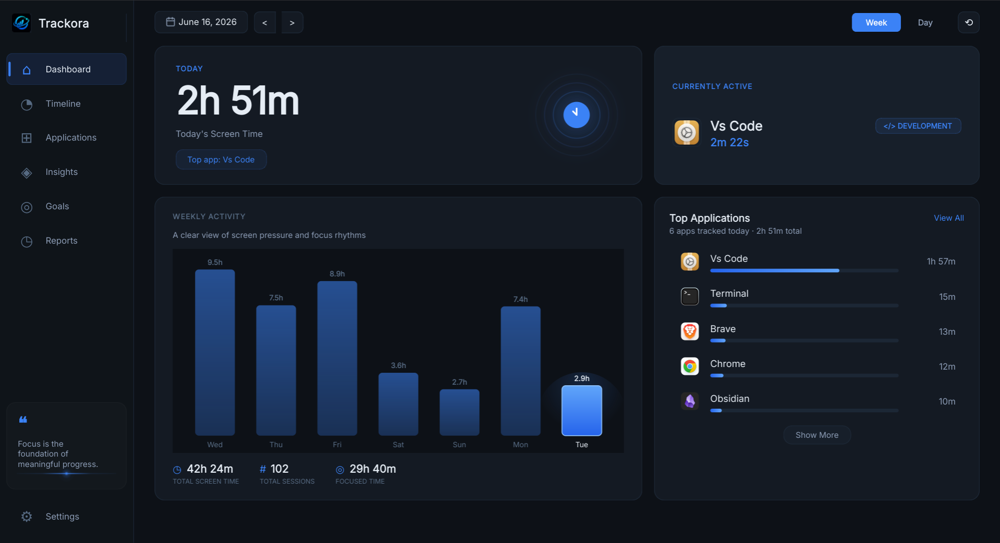
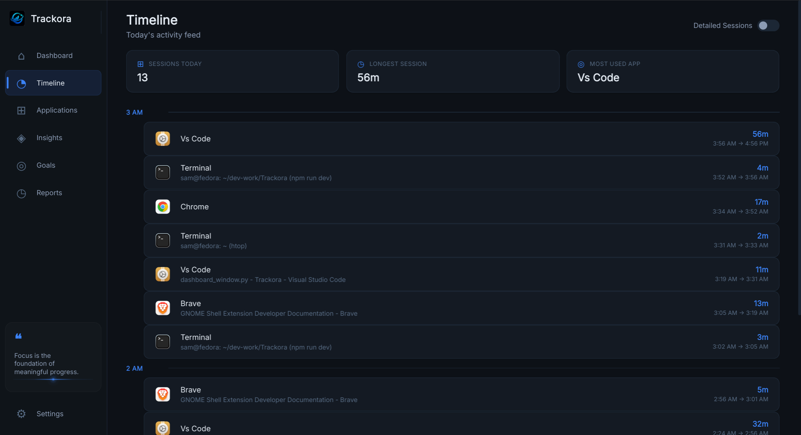
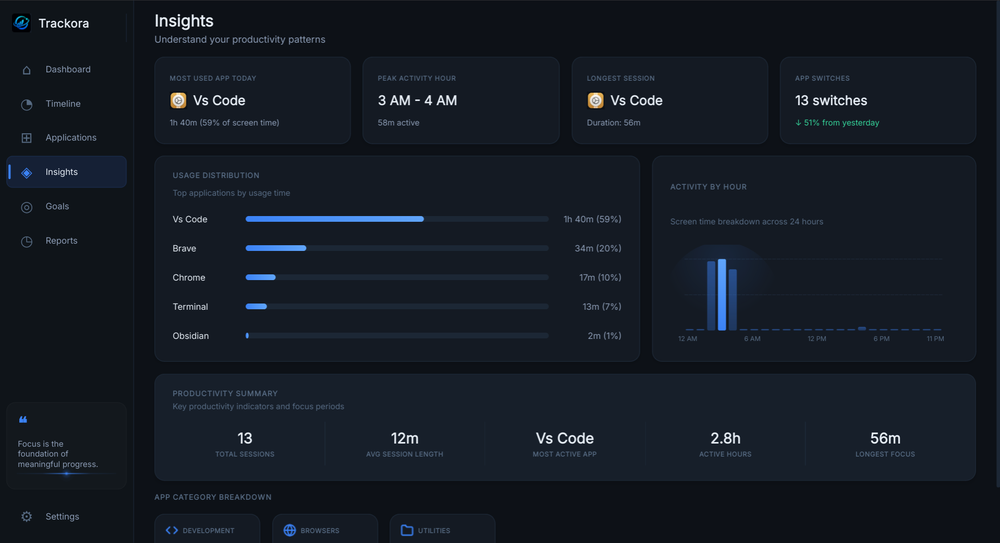
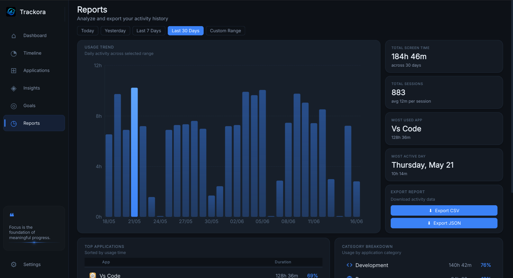
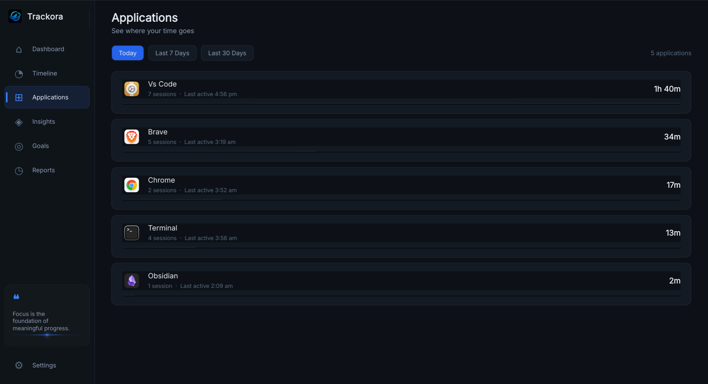
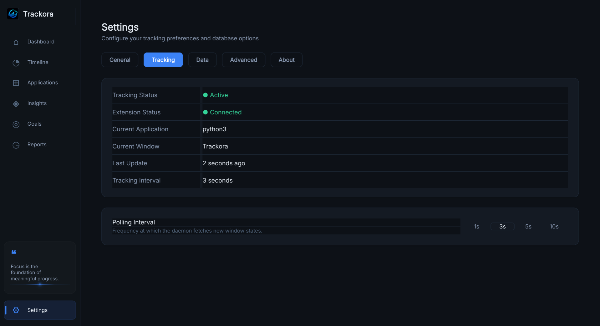

<div align="center">


<br/>

# Trackora
### Premium screen time & app usage tracker for Linux GNOME Wayland

*You work hard. Do you know where the time actually goes?*

Trackora is an elegant, privacy-first productivity tool designed for the modern Linux desktop. It runs silently in the background, logging application usage and window focus, and presents your data in a beautiful, analytical dashboard.

[](LICENSE)
[](https://github.com/SamXop123/Trackora)
[](https://extensions.gnome.org)
[](DEVELOPMENT.md)
[](https://github.com/SamXop123/Trackora/stargazers)


[**Quick Install**](#installation) • [**Architecture**](#architecture) • [**Features**](#features) • [**Screenshots**](#screenshots) • [**Developer Guide**](DEVELOPMENT.md)

</div>

<br/>

---

<br/>

## Why Trackora?

You open your laptop at 9am with a clear plan.

By noon, you're not sure what happened.

You *feel* like you coded, answered emails, did research. But the day has this strange quality of slipping away — sessions blur together, "quick breaks" expand silently, and the question *"what did I actually do today?"* has no clean answer.

This isn't a discipline problem. It's a **visibility problem.**

Most productivity tools make you do work to track your work. They want timers, check-ins, rituals, and habits you have to build. They assume you'll remember to start and stop things. You won't. Nobody does.

**Trackora takes a different approach.**

Install it. Use your computer exactly as you always have. Trackora watches quietly in the background and builds a precise, beautiful picture of your day — every app, every session, every pattern — without you doing anything at all.

Then, whenever you're curious: *open it, and know.*

<br/> 

---

<br/>

## Installation

### Supported Environment

Trackora is currently optimized and tested for:

* Fedora Linux
* GNOME Desktop
* Wayland Session


### Option 1: Download the Release Package (Recommended)

Download the latest release archive from the GitHub Releases page.

Extract the archive:

```bash
tar -xzf trackora-v1.0.0-beta.tar.gz

cd Trackora
```

Run the installer:

```bash
chmod +x install.sh

./install.sh
```

Launch Trackora:

```bash
python3 -m trackora.gui
```

### Option 2: Install from Source

```bash
git clone https://github.com/SamXop123/Trackora.git

cd Trackora

chmod +x install.sh

./install.sh
```

Launch Trackora:

```bash
python3 -m trackora.gui
```

<br/>

*Note: If tracking does not immediately capture active window titles, log out of your GNOME session and log back in to reload the extension.*

<br/>

#### Uninstallation:
If you wish to remove Trackora, run the uninstaller: `./uninstall.sh`

<br/>

---

<br/>

## Architecture

Trackora consists of three lightweight components working in unison:

```
┌───────────────────────────────┐
│     GNOME Shell Extension     │  ← Hooks into shell events to detect window focus changes
└──────────────┬────────────────┘
               │ (Writes state file)
               ▼
┌───────────────────────────────┐
│  Background Tracking Service  │  ← Lightweight daemon monitoring focus changes
└──────────────┬────────────────┘
               │ (Persists sessions)
               ▼
┌───────────────────────────────┐
│        SQLite Database        │  ← Local database (~/.local/share/trackora/)
└──────────────┬────────────────┘
               │ (Queries statistics)
               ▼
┌───────────────────────────────┐
│          PySide6 GUI          │  ← Interactive dashboard launched on demand
└───────────────────────────────┘
```

1. **GNOME Shell Extension**: Monitors active window properties and logs them to a transient JSON state file.
2. **Background Tracking Service**: A systemd user service that polls the state file, filters idle time, and groups sessions.
3. **PySide6 GUI**: A modern desktop client built with custom dark-themed widgets to view metrics, trends, and history.

<br/>

---

<br/>

## Features

### 📊 Dashboard
Your day at a glance. Shows today's accumulated screen time, weekly usage trends, active timeline, and top applications. 

### 🕒 Timeline
Scroll back through your day chronologically. View exactly when you opened which app, how long you stayed, and when you switched. Focus sessions can be consolidated to group fragmented app usage.

### 📱 Application Analytics
A ranked ledger of all applications used, sorted by total duration. Includes metrics like session counts, average session length, and frequency.

### 💡 Insights
Understands your workspace habits. Surfaced insights include peak usage hours, focus metrics, context switching rate, and application categories.

### 📈 Reports
Review historical data across days, weeks, or custom date ranges. Zoom out to see long-term habits or export raw tables.

### ⚙️ Settings & Diagnostics
Full visibility into the health of the background daemon, database connection, and file locations. Allows quick database backups or complete data purging.

<br/>

---

<br/>

## Screenshots

*(Screenshots will be uploaded here in the v1.0.0-beta release assets)*

| Dashboard | Timeline |
|:---:|:---:|
|  |  |
| *Live activity overview* | *Session breakdown timeline* |

| Insights | Reports |
|:---:|:---:|
|  |  |
| *Productivity & habit patterns* | *Custom date range logs* |

| Application | Settings |
|:---:|:---:|
|  |  |
| *Applications usage breakdown* | *Trackora Settings & Info* |

<br/>

---

<br/>

## Privacy

Trackora is **local-first by design.** Your activity data belongs to you — it never leaves your machine.

Trackora does **not**:

- ☁️ Upload your data anywhere
- 🔐 Require an account or login
- 💳 Require a subscription
- 📡 Send telemetry or analytics to external servers

Everything is stored in a local SQLite database on your own filesystem. You can inspect it, export it, back it up, or delete it at any time from within the app.


---


### Planned Features (Roadmap)
* **v1.1 (Goals & Targets)**: Set daily limits for specific apps or categories and track target completion.
* **Productivity Scoring**: Rate application usage from productive to distracting to generate a daily score.
* **Extended Export Formats**: PDF report generation and CSV exports.


---


## Contributing

Trackora is actively developed and welcomes contributions of all kinds.

- 🐛 **Found a bug?** [Open an issue](https://github.com/SamXop123/Trackora/issues)
- 💡 **Have an idea?** [Start a discussion](https://github.com/SamXop123/Trackora/discussions)
- 🔧 **Want to build?** Read [DEVELOPMENT.md](DEVELOPMENT.md) for architecture, setup, and contributor docs, then open a pull request

If Trackora helped you understand your time a little better, **a star ⭐ means a lot.** It helps other Linux users find the project.

---

<br/>

<div align="center">

Built for Linux users who want to understand their time.


*Stop guessing. Start knowing.*

</div>
